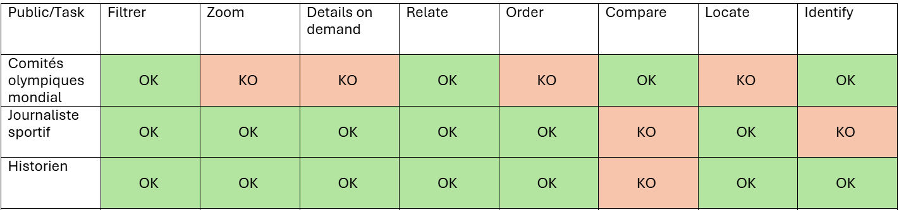
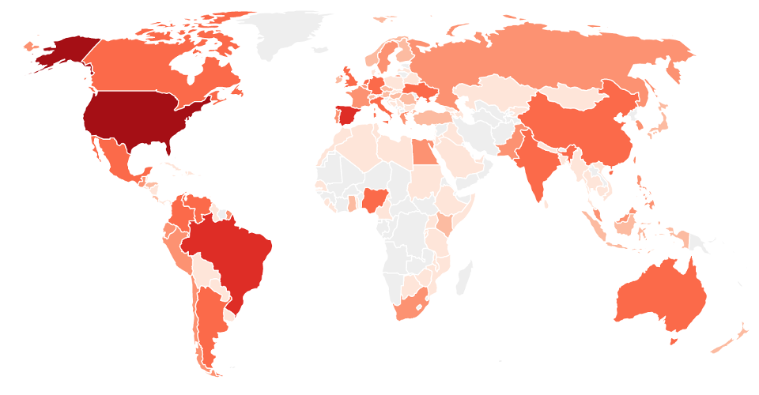
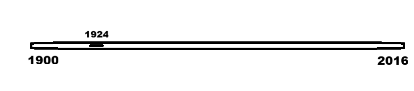
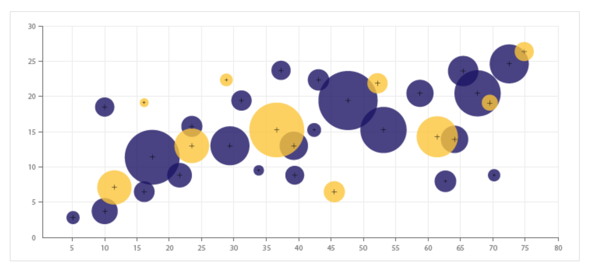

# ProjetUX-Brochet-Landras-Rieuvernet

BD souhaité: [JO Dataset](https://www.kaggle.com/datasets/heesoo37/120-years-of-olympic-history-athletes-and-results?resource=download).

## Objet de l’analyse: 

Existe-t-il une corrélation entre le nombre d'habitant/le nombre de participation d'un pays et le nombre de médaille gagné ?

## Liste des tâches utilisateurs: 

| User Task         | Description   |
| -------------     |:-------------:|
| Filter            | Filtrer par saison/sexe |
| Zoom              | Se concentrer sur une édition spécifique |
| Details-on-demand | Afficher le nombre de médailles, le nombre d’habitants, le nombre de participations... |
| Relate             | Est ce qu’il y a une corrélation entre le nombre d’habitants/nombre de participations et les médailles obtenues |
| Order              | Trier les pays par ratio  |
| Compare            | Comparer la proportion pour un pays et la moyenne global    |
| Locate             | Par pays   |
| Identify           | Un intervalle  par population   |

## Publics ciblés:

1. **Commités Internationals des Jeux olympiques** qui cherchent à prouver que chaque nation, peut-importe sa taille a la possibilité de gagner des médailles. 
2. **Journalistes sportifs** qui souhaitent analyser sous un angle différents le nombre de victoires de chaque nation, en les mettant à l'échelle de la population des pays et du nombre de participants par édition.
3. **Historien** qui souhaitent analyser les évolutions au cours de l'histoire des Jeux Olympiques à travers différents critères comme la proportion de victoire entre hommes et femmes, ou la quantité de médailles par épreuve pour chaque pays.
 
Tâches par types d'utilisateurs: 

# Visualisation de Romain Brochet

### Technique de visualisation

**Graphique à bulles**: 

Avec une barre d'animation pour la temporalité

**Barre animation** : 

# Visualisation de Adrien Landras

### Technique de visualisation

**Rose de Nightingale** : 

### Objectfis :

Comparer les ratios nombre de médailles par nombre d'habitants et nombre de participations sur une année.

Dimension temps : Animation sur les années

# Visualisation de Nicolas Rieuvernet

### Technique de visualisation

**Graphique à bulles**: 

### Axes :

X = Nombre de participants par pays sur une année

Y = Nombre de médailles par pays sur une année

Taille des bulles = Nombre d'habitants par pays sur une année

Couleur = Saison de Jeux Olympiques (Hiver/Eté)

Dimension de temps = Animation sur les années