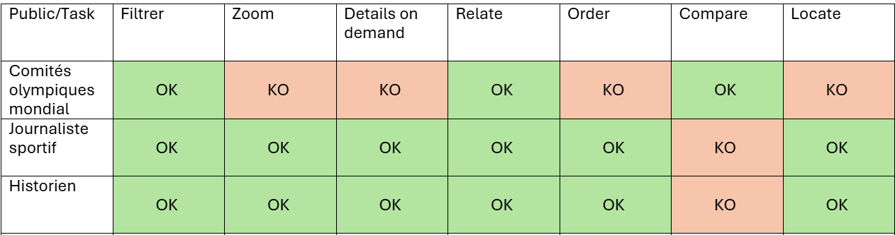
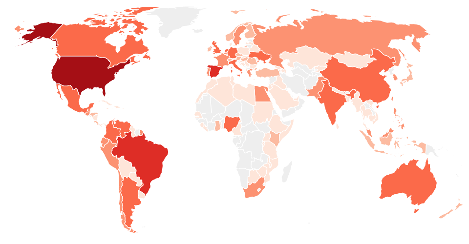
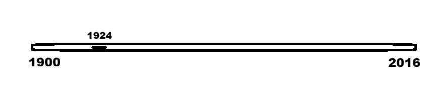
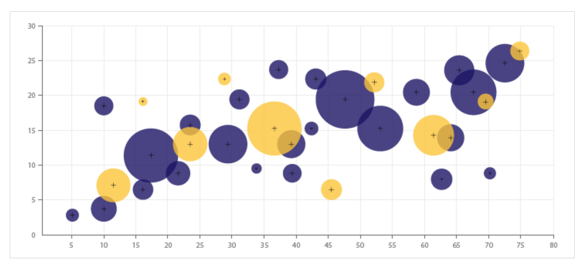

# ProjetUX-Brochet-Landras-Rieuvernet

BD souhaité: [JO Dataset](https://www.kaggle.com/datasets/heesoo37/120-years-of-olympic-history-athletes-and-results?resource=download).

## Objet de l’analyse: 

Existe-t-il une corrélation entre le nombre d'habitant/le nombre de participation d'un pays et le nombre de médaille gagné ?

## Liste des tâches utilisateurs: 

| User Task         | Description   |
| -------------     |:-------------:|
| Filter            | Filtrer par saison/sexe |
| Zoom              | Se concentrer sur une édition spécifique |
| Details-on-demand | Afficher le nombre de médailles, le nombre d’habitants, le nombre de participations... |
| Relate             | Est ce qu’il y a une corrélation entre le nombre d’habitants/nombre de participations et les médailles obtenues |
| Order              | Trier les pays par ratio  |
| Compare            | Comparer la proportion pour un pays et la moyenne global    |
| Locate             | Par pays   |
| Identify           | Un intervalle  par population   |

## Publics ciblés:

1. **Commités Internationals des Jeux olympiques** qui cherchent à prouver que chaque nation, peut-importe sa taille a la possibilité de gagner des médailles. 
2. **Journalistes sportifs** qui souhaitent analyser sous un angle différents le nombre de victoires de chaque nation, en les mettant à l'échelle de la population des pays et du nombre de participants par édition.
3. **Historien** qui souhaitent analyser les évolutions au cours de l'histoire des Jeux Olympiques à travers différents critères comme la proportion de victoire entre hommes et femmes, ou la quantité de médailles par épreuve pour chaque pays.
 
Tâches par types d'utilisateurs: 

# Datasets utilisés dans le projet

## 1. Dataset Jeux Olympiques (1896-2016)

| ID | Name | Sex | Age | Height | Weight | Team | **NOC** | Games | **Year** | **Season** | City | Sport | Event | **Medal** |
|---|---|---|---|---|---|---|---|---|---|---|---|---|---|---|
| 1 | A Dijiang | M | 24 | 180 | 80 | China | **CHN** | 1992 Summer | **1992** | **Summer** | Barcelona | Basketball | Basketball Men's Basketball | **(vide)** |
| 4 | Edgar Lindenau Aabye | M | 34 | 195 | 90 | Denmark/Sweden | **DEN** | 1900 Summer | **1900** | **Summer** | Paris | Tug-Of-War | Tug-Of-War Men's | **Gold** |
| 15 | John Smith | M | 28 | 175 | 70 | United States | **USA** | 1992 Summer | **1992** | **Summer** | Barcelona | Athletics | 4x100m Relay Men | **Gold** |
| 16 | Michael Johnson | M | 25 | 178 | 72 | United States | **USA** | 1992 Summer | **1992** | **Summer** | Barcelona | Athletics | 4x100m Relay Men | **Gold** |
| 17 | Carl Lewis | M | 31 | 188 | 80 | United States | **USA** | 1992 Summer | **1992** | **Summer** | Barcelona | Athletics | 4x100m Relay Men | **Gold** |
| 18 | Dennis Mitchell | M | 27 | 175 | 68 | United States | **USA** | 1992 Summer | **1992** | **Summer** | Barcelona | Athletics | 4x100m Relay Men | **Gold** |
| 234 | Aleksandr Ivanov | M | 26 | 182 | 78 | Soviet Union | **URS** | 1988 Winter | **1988** | **Winter** | Calgary | Ice Hockey | Ice Hockey Men | **Gold** |
| 567 | Vladimir Petrov | M | 29 | 185 | 83 | Russia | **RUS** | 1994 Winter | **1994** | **Winter** | Lillehammer | Ice Hockey | Ice Hockey Men | **(vide)** |

**Colonnes conservées** : NOC, Year, Season, Medal, ID

## 2. Dataset Population mondiale (-10000-2100)

| Entity | **Code** | **Year** | **Population (historical)** | Continent |
|---|---|---|---|---|
| Afghanistan | **AFG** | **1900** | **4,707,744** | Asia |
| Afghanistan | **AFG** | **1992** | **14,889,000** | Asia |
| Afghanistan | **AFG** | **2016** | **34,656,032** | Asia |
| China | **CHN** | **1992** | **1,164,970,000** | Asia |
| Denmark | **DNK** | **1900** | **2,450,000** | Europe |
| Soviet Union | **(absent)** | **1988** | **(absent)** | **(absent)** |
| Russia | **RUS** | **1994** | **148,394,000** | Europe |
| United States | **USA** | **1850** | **23,261,000** | North America |
| United States | **USA** | **1992** | **256,894,000** | North America |
| United States | **USA** | **2020** | **331,003,000** | North America |

**Colonnes conservées** : Code, Year, Population (historical)

# Visualisation de Romain Brochet

### Technique de visualisation

**Graphique Choropleth Map**: 

Avec une barre d'animation pour la temporalité

**Barre animation** : 

# Visualisation de Adrien Landras

### Technique de visualisation

**Rose de Nightingale** : 

### Objectfis :

Comparer les ratios nombre de médailles par nombre d'habitants et nombre de participations sur une année.

Dimension temps : Animation sur les années

# Visualisation de Nicolas Rieuvernet

### Technique de visualisation

**Graphique à bulles**: 

### Axes :

X = Nombre de participants par pays sur une année

Y = Nombre d'habitants par pays sur une année

Taille des bulles = Nombre de médailles par pays sur une année

Couleur = Continent d'appartenance de chaque pays

Dimension de temps = Animation sur les années